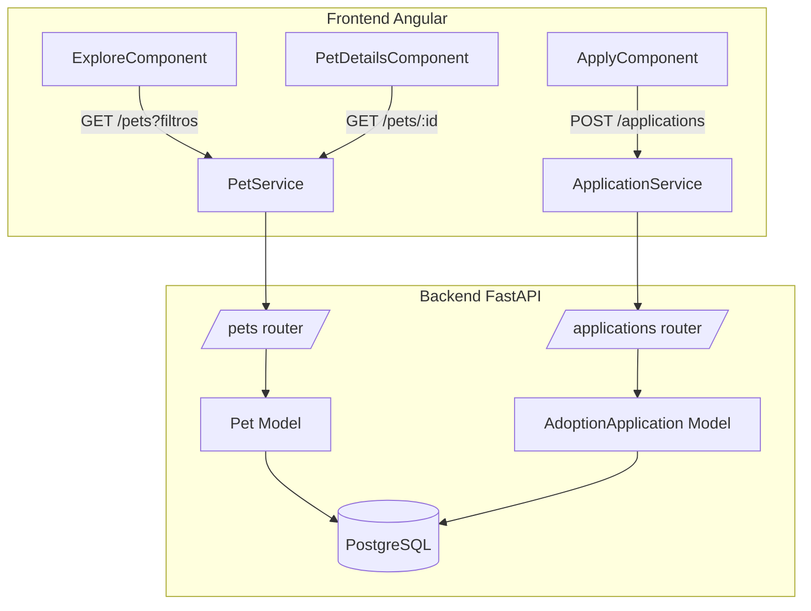

# Documento de Design: pet-adoption-core

## Visão Geral

O núcleo de adoção de pets implementa o fluxo completo que permite a um adotante descobrir pets disponíveis, visualizar seus detalhes e submeter uma candidatura de adoção. A solução é dividida em três camadas:

- **Backend (FastAPI)**: expõe endpoints REST para CRUD de pets e criação de candidaturas.
- **Banco de dados (PostgreSQL)**: persiste pets, usuários e candidaturas via SQLAlchemy ORM.
- **Frontend (Angular)**: consome a API e renderiza as páginas de listagem, detalhes e formulário de candidatura.

O projeto já possui a estrutura base (models, schemas, routers, serviços Angular e componentes de página) parcialmente implementada. Este design descreve o estado alvo completo e os ajustes necessários.

---

## Arquitetura



O frontend se comunica exclusivamente via HTTP com o backend. Não há estado compartilhado entre componentes além do roteamento Angular. O backend não possui autenticação obrigatória nesta fase (MVP).

---

## Componentes e Interfaces

### Backend

#### Router de Pets (`routers/pets.py`)

| Método | Rota | Descrição |
|--------|------|-----------|
| GET | `/pets` | Lista pets com filtros opcionais |
| GET | `/pets/{pet_id}` | Retorna um pet pelo ID |
| POST | `/pets` | Cadastra um novo pet |

Filtros suportados no GET `/pets`: `species`, `size`, `age_group`, `city`, `apartment_friendly`, `good_with_kids`.

#### Router de Candidaturas (`routers/applications.py`)

| Método | Rota | Descrição |
|--------|------|-----------|
| POST | `/applications` | Cria uma candidatura de adoção |
| GET | `/applications/user/{user_id}` | Lista candidaturas de um usuário |
| PUT | `/applications/{app_id}/status` | Atualiza status de uma candidatura |

### Frontend

#### `PetService` (`core/services/pet.service.ts`)

```typescript
getPets(filters?: PetFilters): Observable<Pet[]>
getPet(id: number): Observable<Pet>
```

#### `ApplicationService` (`core/services/application.service.ts`)  
Serviço a ser criado:

```typescript
createApplication(payload: ApplicationCreate): Observable<ApplicationResponse>
getUserApplications(userId: number): Observable<ApplicationResponse[]>
```

#### Componentes Angular

| Componente | Rota | Responsabilidade |
|------------|------|-----------------|
| `ExploreComponent` | `/explore` | Listagem com filtros |
| `PetDetailsComponent` | `/pets/:id` | Detalhes do pet |
| `ApplyComponent` | `/apply/:id` | Formulário de candidatura |

---

## Modelos de Dados

### Pet (SQLAlchemy / Pydantic)

```python
class Pet(Base):
    id: int                        # PK, auto-increment
    name: str                      # obrigatório
    species: str                   # "dog" | "cat"
    breed: str
    age_group: str                 # "puppy" | "young" | "adult" | "senior"
    age_description: str
    size: str                      # "small" | "medium" | "large"
    sex: str                       # "male" | "female"
    color: str
    shelter_name: str
    city: str
    status: str                    # "Available" | "Reserved" | "Adopted"
    description: str | None
    is_vaccinated: bool = True
    is_neutered: bool = True
    good_with_kids: bool = False
    good_with_dogs: bool = False
    good_with_cats: bool = False
    apartment_friendly: bool = False
    first_time_owner_friendly: bool = False
    image_url: str | None
```

### AdoptionApplication (SQLAlchemy / Pydantic)

```python
class AdoptionApplication(Base):
    id: int                        # PK, auto-increment
    user_id: int                   # FK -> users.id
    pet_id: int                    # FK -> pets.id
    housing_type: str              # ex: "apartment", "house"
    motivation: str                # texto livre
    status: str = "New"            # "New" | "Screening" | "Interview" | "Approved" | "Rejected"
    compatibility_score: float = 85.0
```

### Interface TypeScript `Pet`

```typescript
export interface Pet {
  id: number;
  name: string; species: string; breed: string;
  age_group: string; age_description: string;
  size: string; sex: string; color: string;
  shelter_name: string; city: string; status: string;
  description?: string;
  is_vaccinated: boolean; is_neutered: boolean;
  good_with_kids: boolean; good_with_dogs: boolean;
  good_with_cats: boolean; apartment_friendly: boolean;
  first_time_owner_friendly: boolean;
  image_url?: string;
}
```

### Interface TypeScript `ApplicationCreate` / `ApplicationResponse`

```typescript
export interface ApplicationCreate {
  user_id: number;
  pet_id: number;
  housing_type: string;
  motivation: string;
}

export interface ApplicationResponse extends ApplicationCreate {
  id: number;
  status: string;
  compatibility_score: number;
}
```

---

## Propriedades de Corretude

*Uma propriedade é uma característica ou comportamento que deve ser verdadeiro em todas as execuções válidas do sistema — essencialmente, uma afirmação formal sobre o que o sistema deve fazer. Propriedades servem como ponte entre especificações legíveis por humanos e garantias de corretude verificáveis por máquina.*

### Propriedade 1: Filtros retornam subconjunto consistente

*Para qualquer* conjunto de pets cadastrados e qualquer combinação de filtros válidos, todos os pets retornados pelo endpoint GET `/pets` devem satisfazer todos os filtros aplicados, e nenhum pet que satisfaça todos os filtros deve ser omitido da resposta.

**Valida: Requisitos 2.3, 2.4, 2.5, 2.6, 2.7, 2.8, 2.9**

---

### Propriedade 2: Persistência e recuperação de pet (round-trip)

*Para qualquer* pet criado via POST `/pets`, uma chamada subsequente a GET `/pets/{id}` deve retornar um objeto equivalente ao que foi enviado na criação.

**Valida: Requisitos 1.2, 1.5, 3.1, 3.2**

---

### Propriedade 3: Pet inexistente retorna 404

*Para qualquer* `pet_id` que não exista no banco de dados, o endpoint GET `/pets/{pet_id}` deve retornar HTTP 404.

**Valida: Requisito 3.3**

---

### Propriedade 4: Candidatura persiste com status inicial "New"

*Para qualquer* candidatura criada via POST `/applications` com dados válidos, o campo `status` do objeto retornado deve ser `"New"`, e a candidatura deve ser recuperável via GET `/applications/user/{user_id}`.

**Valida: Requisitos 4.4, 4.8**

---

### Propriedade 5: Campos obrigatórios ausentes geram erro de validação

*Para qualquer* requisição POST a `/pets` ou `/applications` com pelo menos um campo obrigatório ausente, a API deve retornar HTTP 422.

**Valida: Requisitos 1.3, 4.5**

---

## Tratamento de Erros

| Situação | Comportamento esperado |
|----------|----------------------|
| `pet_id` inexistente no GET `/pets/{id}` | HTTP 404, `{"detail": "Pet not found"}` |
| Campo obrigatório ausente no POST `/pets` | HTTP 422, detalhes do campo inválido |
| Campo obrigatório ausente no POST `/applications` | HTTP 422, detalhes do campo inválido |
| Falha de conexão com o banco | HTTP 500, log de erro no servidor |
| Falha de rede no frontend (PetService) | Componente exibe mensagem de erro ao usuário |
| Falha de rede no frontend (ApplicationService) | ApplyComponent exibe mensagem de erro ao usuário |

---

## Estratégia de Testes

### Abordagem Dual

A estratégia combina testes unitários e testes baseados em propriedades (property-based testing), que são complementares:

- **Testes unitários**: verificam exemplos concretos, casos de borda e condições de erro.
- **Testes de propriedade**: verificam propriedades universais sobre um espaço amplo de entradas geradas aleatoriamente.

### Backend (Python)

- **Framework de testes**: `pytest` com `httpx.AsyncClient` para testes de integração dos endpoints.
- **Property-based testing**: `hypothesis` (biblioteca madura para Python).
- Banco de dados de teste: SQLite em memória (via `create_engine("sqlite:///:memory:")`) para isolamento.
- Mínimo de **100 iterações** por teste de propriedade.

#### Testes unitários (exemplos e casos de borda)

- POST `/pets` com payload válido → 201 + objeto retornado.
- POST `/pets` com campo ausente → 422.
- GET `/pets/{id}` com ID existente → 200 + dados corretos.
- GET `/pets/{id}` com ID inexistente → 404.
- POST `/applications` com payload válido → 200 + `status == "New"`.
- POST `/applications` com campo ausente → 422.

#### Testes de propriedade

Cada propriedade do design deve ser implementada como um único teste de propriedade:

- **Feature: pet-adoption-core, Propriedade 1**: Filtros retornam subconjunto consistente
- **Feature: pet-adoption-core, Propriedade 2**: Persistência e recuperação de pet (round-trip)
- **Feature: pet-adoption-core, Propriedade 3**: Pet inexistente retorna 404
- **Feature: pet-adoption-core, Propriedade 4**: Candidatura persiste com status inicial "New"
- **Feature: pet-adoption-core, Propriedade 5**: Campos obrigatórios ausentes geram erro de validação

### Frontend (Angular)

- **Framework de testes**: `Jest` (ou Karma/Jasmine já configurado no projeto).
- Testes unitários para `PetService` e `ApplicationService` com `HttpClientTestingModule`.
- Testes de componente para `ExploreComponent`, `PetDetailsComponent` e `ApplyComponent` com mocks dos serviços.
- Foco em: renderização correta dos dados, comportamento dos filtros, exibição de mensagens de erro e confirmação.
