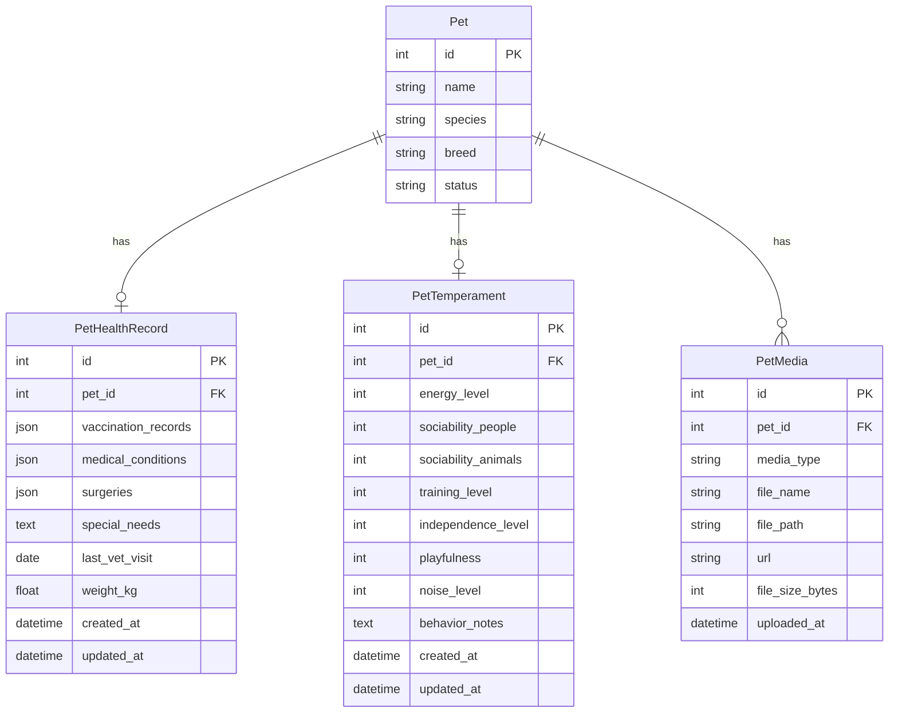

# Design Document

## Overview

Este documento descreve o design técnico para a funcionalidade de perfis detalhados de pets na plataforma de adoção. A feature estende o modelo existente de `Pet` com três novos domínios de dados: **registro de saúde**, **perfil de temperamento** e **galeria de mídias** (fotos e vídeos). A arquitetura segue o padrão já estabelecido no projeto (FastAPI + SQLAlchemy no backend, Angular standalone components no frontend) e adiciona armazenamento de arquivos em disco local com possibilidade de migração futura para object storage (S3/MinIO).

### Decisões de Design

- **Tabelas separadas** em vez de JSON em colunas: permite queries, validação em nível de banco e evolução independente dos schemas.
- **Armazenamento local de mídia** com servir estático via FastAPI: simplifica o MVP sem dependência externa. O path de upload é configurável via variável de ambiente para facilitar migração futura.
- **Relacionamento 1:1** para saúde e temperamento (um registro por pet), **1:N** para mídias (até 20 por pet).
- **Chamadas paralelas no frontend** com `forkJoin` do RxJS para carregar seções independentemente, permitindo graceful degradation por seção.

---

## Architecture

```mermaid
graph TD
    subgraph Frontend [Angular Frontend]
        PD[PetDetailsComponent]
        HI[HealthInfoComponent]
        TC[TemperamentComponent]
        MG[MediaGalleryComponent]
        MU[MediaUploadComponent]
        PS[PetService - extended]
    end

    subgraph Backend [FastAPI Backend]
        HR[/pets/{id}/health Router]
        TR[/pets/{id}/temperament Router]
        MR[/pets/{id}/media Router]
        Models[SQLAlchemy Models]
        FS[File Storage Service]
    end

    subgraph Database [PostgreSQL]
        PetTable[pets]
        HealthTable[pet_health_records]
        TempTable[pet_temperaments]
        MediaTable[pet_media]
    end

    subgraph Storage [File System]
        Uploads[/uploads/pets/{pet_id}/]
    end

    PD --> HI
    PD --> TC
    PD --> MG
    PD --> MU
    PD --> PS

    PS -->|HTTP| HR
    PS -->|HTTP| TR
    PS -->|HTTP| MR

    HR --> Models
    TR --> Models
    MR --> Models
    MR --> FS

    Models --> HealthTable
    Models --> TempTable
    Models --> MediaTable
    FS --> Uploads

    HealthTable -->|FK| PetTable
    TempTable -->|FK| PetTable
    MediaTable -->|FK| PetTable
```

### Fluxo de Dados

1. **Leitura (Adotante):** `PetDetailsComponent` dispara chamadas paralelas a 4 endpoints. Cada seção renderiza independentemente conforme a resposta chega.
2. **Escrita (Cuidador):** Formulários de saúde/temperamento enviam JSON via POST/PUT. Upload de mídia usa `multipart/form-data` com um único arquivo por requisição.
3. **Armazenamento de arquivos:** O backend salva arquivos em `UPLOAD_DIR/pets/{pet_id}/{uuid}.{ext}` e registra metadados na tabela `pet_media`. O endpoint GET retorna URLs estáticas servidas pelo FastAPI.

---

## Components and Interfaces

### Backend Components

#### Router: `pet_health.py`

| Método | Endpoint | Descrição |
|--------|----------|-----------|
| GET | `/pets/{pet_id}/health` | Retorna registro de saúde do pet |
| POST | `/pets/{pet_id}/health` | Cria registro de saúde |
| PUT | `/pets/{pet_id}/health` | Atualiza registro de saúde |

#### Router: `pet_temperament.py`

| Método | Endpoint | Descrição |
|--------|----------|-----------|
| GET | `/pets/{pet_id}/temperament` | Retorna perfil de temperamento |
| POST | `/pets/{pet_id}/temperament` | Cria perfil de temperamento |
| PUT | `/pets/{pet_id}/temperament` | Atualiza perfil de temperamento |

#### Router: `pet_media.py`

| Método | Endpoint | Descrição |
|--------|----------|-----------|
| GET | `/pets/{pet_id}/media` | Lista mídias do pet (ordenado por data desc) |
| POST | `/pets/{pet_id}/media` | Upload de arquivo de mídia |
| DELETE | `/pets/{pet_id}/media/{media_id}` | Remove uma mídia |

#### Service: `file_storage.py`

Responsável pela lógica de armazenamento de arquivos no filesystem:

```python
class FileStorageService:
    def __init__(self, upload_dir: str):
        self.upload_dir = upload_dir

    def save_file(self, pet_id: int, file: UploadFile) -> str:
        """Salva arquivo e retorna o path relativo."""
        ...

    def delete_file(self, file_path: str) -> None:
        """Remove arquivo do filesystem."""
        ...

    def get_url(self, file_path: str) -> str:
        """Retorna URL pública do arquivo."""
        ...
```

### Frontend Components

#### `HealthInfoComponent` (standalone)
- **Input:** `petId: number`
- **Responsabilidade:** Buscar e exibir registro de saúde (vacinação, condições, cirurgias, necessidades especiais, peso, última visita)
- **Estados:** loading, loaded, empty (sem registro), error

#### `TemperamentComponent` (standalone)
- **Input:** `petId: number`
- **Responsabilidade:** Buscar e exibir perfil de temperamento em barras/escalas visuais de 1 a 5
- **Estados:** loading, loaded, empty, error

#### `MediaGalleryComponent` (standalone)
- **Input:** `media: PetMedia[]`, `defaultImageUrl: string`
- **Responsabilidade:** Exibir carrossel de fotos, player de vídeo, modal de visualização
- **Interações:** Navegação carrossel, click para modal, controles de vídeo

#### `MediaUploadComponent` (standalone)
- **Input:** `petId: number`
- **Responsabilidade:** Drag-and-drop de arquivos, preview, upload com progress bar
- **Condição de exibição:** Apenas para cuidador autenticado responsável pelo pet

#### `PetDetailsComponent` (estendido)
- Adiciona abas/seções para Saúde, Temperamento e Galeria
- Chamadas paralelas com `forkJoin` e tratamento individual de erros por seção
- Layout responsivo: abas em desktop (>768px), empilhado em mobile

### API Request/Response Schemas

#### Health Record Schemas

```python
class VaccinationRecord(BaseModel):
    vaccine_name: str
    date_administered: date
    expiry_date: Optional[date] = None

class MedicalCondition(BaseModel):
    condition_name: str
    diagnosed_date: Optional[date] = None
    notes: Optional[str] = None

class Surgery(BaseModel):
    surgery_name: str
    surgery_date: date
    description: Optional[str] = None

class PetHealthRecordCreate(BaseModel):
    vaccination_records: List[VaccinationRecord] = []  # max 100
    medical_conditions: List[MedicalCondition] = []    # max 50
    surgeries: List[Surgery] = []                      # max 50
    special_needs: Optional[str] = None                # max 2000 chars
    last_vet_visit: Optional[date] = None
    weight_kg: Optional[float] = None                  # 0.01 - 200.00

class PetHealthRecordResponse(PetHealthRecordCreate):
    id: int
    pet_id: int
    created_at: datetime
    updated_at: datetime
    model_config = ConfigDict(from_attributes=True)
```

#### Temperament Schemas

```python
class PetTemperamentCreate(BaseModel):
    energy_level: int          # 1-5
    sociability_people: int    # 1-5
    sociability_animals: int   # 1-5
    training_level: int        # 1-5
    independence_level: int    # 1-5
    playfulness: int           # 1-5
    noise_level: int           # 1-5
    behavior_notes: Optional[str] = None  # max 2000 chars

class PetTemperamentResponse(PetTemperamentCreate):
    id: int
    pet_id: int
    created_at: datetime
    updated_at: datetime
    model_config = ConfigDict(from_attributes=True)
```

#### Media Schemas

```python
class PetMediaResponse(BaseModel):
    id: int
    pet_id: int
    media_type: str        # "photo" ou "video"
    file_name: str
    url: str
    uploaded_at: datetime
    model_config = ConfigDict(from_attributes=True)
```

---

## Data Models

### Diagrama ER



### SQLAlchemy Models

```python
from sqlalchemy import Column, Integer, String, Float, Text, DateTime, ForeignKey, JSON
from sqlalchemy.sql import func

class PetHealthRecord(Base):
    __tablename__ = "pet_health_records"

    id = Column(Integer, primary_key=True, index=True)
    pet_id = Column(Integer, ForeignKey("pets.id"), unique=True, nullable=False, index=True)
    vaccination_records = Column(JSON, default=list)
    medical_conditions = Column(JSON, default=list)
    surgeries = Column(JSON, default=list)
    special_needs = Column(Text, nullable=True)
    last_vet_visit = Column(DateTime, nullable=True)
    weight_kg = Column(Float, nullable=True)
    created_at = Column(DateTime, server_default=func.now())
    updated_at = Column(DateTime, server_default=func.now(), onupdate=func.now())


class PetTemperament(Base):
    __tablename__ = "pet_temperaments"

    id = Column(Integer, primary_key=True, index=True)
    pet_id = Column(Integer, ForeignKey("pets.id"), unique=True, nullable=False, index=True)
    energy_level = Column(Integer, nullable=False)
    sociability_people = Column(Integer, nullable=False)
    sociability_animals = Column(Integer, nullable=False)
    training_level = Column(Integer, nullable=False)
    independence_level = Column(Integer, nullable=False)
    playfulness = Column(Integer, nullable=False)
    noise_level = Column(Integer, nullable=False)
    behavior_notes = Column(Text, nullable=True)
    created_at = Column(DateTime, server_default=func.now())
    updated_at = Column(DateTime, server_default=func.now(), onupdate=func.now())


class PetMedia(Base):
    __tablename__ = "pet_media"

    id = Column(Integer, primary_key=True, index=True)
    pet_id = Column(Integer, ForeignKey("pets.id"), nullable=False, index=True)
    media_type = Column(String, nullable=False)  # "photo" or "video"
    file_name = Column(String, nullable=False)
    file_path = Column(String, nullable=False)
    url = Column(String, nullable=False)
    file_size_bytes = Column(Integer, nullable=False)
    uploaded_at = Column(DateTime, server_default=func.now())
```

### Decisões de Modelagem

- **`vaccination_records`, `medical_conditions`, `surgeries` como JSON:** Cada entrada é uma lista de objetos com estrutura validada pelo Pydantic no nível da API. Usar JSON evita a complexidade de tabelas associativas para listas aninhadas que sempre são lidas/escritas em bloco.
- **`pet_id` com `unique=True`** em `PetHealthRecord` e `PetTemperament`: garante relação 1:1 em nível de banco.
- **`file_path` separado de `url`** em `PetMedia`: permite trocar a lógica de URL (de local para CDN) sem alterar o registro de metadados.

---

## Correctness Properties

*Uma propriedade é uma característica ou comportamento que deve ser verdadeiro em todas as execuções válidas de um sistema — essencialmente, uma declaração formal sobre o que o sistema deve fazer. Propriedades servem como ponte entre especificações legíveis por humanos e garantias de correção verificáveis por máquina.*

### Property 1: Health record serialization round-trip

*For any* valid health record data (with vaccination records containing vaccine_name and date_administered, medical conditions, surgeries, special_needs up to 2000 chars, valid last_vet_visit date, and weight_kg between 0.01 and 200.00), creating the record via POST and then retrieving it via GET should return data equivalent to the original input for all persisted fields.

**Validates: Requirements 1.2, 1.3, 1.4, 1.7**

### Property 2: Health record input validation rejects invalid data

*For any* health record payload where at least one of the following holds: (a) a vaccination_records entry is missing vaccine_name or date_administered, or (b) weight_kg is outside the range [0.01, 200.00], the API shall reject the request with HTTP 422.

**Validates: Requirements 1.10, 1.11, 1.12**

### Property 3: Temperament profile serialization round-trip

*For any* valid temperament profile (with all level fields as integers between 1 and 5, and optional behavior_notes up to 2000 characters), creating the profile via POST and then retrieving it via GET should return data equivalent to the original input for all persisted fields.

**Validates: Requirements 2.2, 2.3, 2.4, 2.7**

### Property 4: Temperament profile input validation rejects invalid data

*For any* temperament profile payload where at least one level field (energy_level, sociability_people, sociability_animals, training_level, independence_level, playfulness, noise_level) has a value outside [1, 5], or behavior_notes exceeds 2000 characters, the API shall reject the request with HTTP 422.

**Validates: Requirements 2.6, 2.13**

### Property 5: Invalid media content-type rejected

*For any* file upload request where the content-type is not one of the allowed types (image/jpeg, image/png, image/webp, video/mp4, video/webm), the API shall reject the request with HTTP 415.

**Validates: Requirements 3.4**

### Property 6: Media list ordering invariant

*For any* pet with multiple media items, the GET `/pets/{pet_id}/media` endpoint shall return items ordered by `uploaded_at` in descending order (most recent first), such that for every consecutive pair of items in the result, the first item's `uploaded_at` is greater than or equal to the second's.

**Validates: Requirements 3.8**

### Property 7: Graceful degradation under partial failures

*For any* subset of the detail endpoints (`/health`, `/temperament`, `/media`) that return errors, the PetDetailsComponent shall still correctly display the sections whose endpoints returned successfully, without blocking or crashing.

**Validates: Requirements 5.4**

---

## Error Handling

### Backend Error Strategy

| Cenário | HTTP Status | Corpo da Resposta |
|---------|-------------|-------------------|
| Pet não encontrado | 404 | `{"detail": "Pet not found"}` |
| Registro de saúde não encontrado | 404 | `{"detail": "Health record not found for this pet"}` |
| Perfil de temperamento não encontrado | 404 | `{"detail": "Temperament profile not found for this pet"}` |
| Mídia não encontrada | 404 | `{"detail": "Media not found"}` |
| Registro de saúde já existe (POST duplicado) | 409 | `{"detail": "Health record already exists for this pet"}` |
| Limite de 20 mídias atingido | 409 | `{"detail": "Maximum of 20 media files reached for this pet"}` |
| Formato de arquivo não suportado | 415 | `{"detail": "Unsupported media type. Accepted: image/jpeg, image/png, image/webp, video/mp4, video/webm"}` |
| Arquivo de imagem > 10 MB | 413 | `{"detail": "Image file size exceeds 10 MB limit"}` |
| Arquivo de vídeo > 100 MB | 413 | `{"detail": "Video file size exceeds 100 MB limit"}` |
| Validação de campos faltantes/inválidos | 422 | `{"detail": [{"field": "...", "message": "..."}]}` |
| Arquivo vazio (0 bytes) | 422 | `{"detail": "File is empty"}` |
| Campo de arquivo ausente | 422 | `{"detail": "File field is required"}` |
| Cuidador não autorizado | 403 | `{"detail": "You are not authorized to manage media for this pet"}` |
| Erro interno (filesystem, DB) | 500 | `{"detail": "Internal server error"}` |

### Frontend Error Strategy

- **Por seção:** Cada seção (saúde, temperamento, mídia) trata erros independentemente. Um erro em uma seção não impede a renderização das demais.
- **Retry:** Cada seção com erro exibe um botão "Tentar novamente" que re-dispara apenas a chamada correspondente.
- **Timeout:** Timeout de 10 segundos por chamada HTTP (configurado no `HttpClient` interceptor ou no `timeout` operator do RxJS).
- **Upload errors:** O `MediaUploadComponent` exibe a mensagem de erro retornada pela API (formato inválido, tamanho excedido, limite atingido) em um toast/alerta inline.
- **Validação client-side:** Antes do upload, o frontend valida tipo e tamanho do arquivo localmente para feedback imediato, evitando roundtrip desnecessário.

### Padrão de Tratamento no Router (Backend)

```python
def get_pet_or_404(pet_id: int, db: Session) -> models.Pet:
    pet = db.query(models.Pet).filter(models.Pet.id == pet_id).first()
    if not pet:
        raise HTTPException(status_code=404, detail="Pet not found")
    return pet

def get_health_record_or_404(pet_id: int, db: Session) -> models.PetHealthRecord:
    record = db.query(models.PetHealthRecord).filter(
        models.PetHealthRecord.pet_id == pet_id
    ).first()
    if not record:
        raise HTTPException(status_code=404, detail="Health record not found for this pet")
    return record
```

---

## Testing Strategy

### Abordagem Dual: Testes Unitários + Property-Based Tests

O projeto já utiliza **Hypothesis** (evidenciado pelo diretório `.hypothesis/` existente). A estratégia de testes combina:

#### Property-Based Tests (Hypothesis)

- **Biblioteca:** Hypothesis (já instalada no projeto)
- **Mínimo de iterações:** 100 por property test
- **Tag format:** `Feature: pet-detailed-profiles, Property {N}: {description}`
- Cada correctness property do design será implementada como um teste Hypothesis

**Properties a implementar:**
1. Round-trip de health records (gerar dados válidos → POST → GET → comparar)
2. Rejeição de health records inválidos (gerar dados com violações → POST → verificar 422)
3. Round-trip de temperament profiles (gerar perfis válidos → POST → GET → comparar)
4. Rejeição de temperament profiles inválidos (gerar níveis fora de [1,5] ou notes > 2000 → POST → verificar 422)
5. Rejeição de content-types inválidos (gerar tipos aleatórios fora da whitelist → POST → verificar 415)
6. Invariante de ordenação da lista de mídias (criar mídias → GET → verificar ordem desc)
7. Graceful degradation (simular falhas parciais → verificar renderização das seções restantes)

#### Testes Unitários (pytest)

- Casos específicos de erro (404, 409, 403, 413)
- Edge cases: arquivo vazio, campo ausente, limite de 20 mídias
- Integração com filesystem (mock do `FileStorageService`)

#### Testes de Componente (Angular - Jasmine/Karma)

- Renderização correta de dados de saúde e temperamento
- Carrossel de fotos: navegação, modal
- Upload: drag-and-drop, preview, progress, erro
- Layout responsivo: breakpoint 768px
- Estados: loading, empty, error com retry

### Estrutura de Diretórios de Teste

```
backend/tests/
├── test_pet_health.py          # Unit + property tests para health
├── test_pet_temperament.py     # Unit + property tests para temperament
├── test_pet_media.py           # Unit + integration tests para media
└── conftest.py                 # Fixtures compartilhadas

frontend/src/app/pages/pet-details/
├── health-info/
│   └── health-info.component.spec.ts
├── temperament/
│   └── temperament.component.spec.ts
├── media-gallery/
│   └── media-gallery.component.spec.ts
└── media-upload/
    └── media-upload.component.spec.ts
```

### File Storage Strategy

- **Diretório base:** Configurável via `UPLOAD_DIR` (env var), default `./uploads`
- **Estrutura:** `{UPLOAD_DIR}/pets/{pet_id}/{uuid}.{ext}`
- **Servir arquivos:** FastAPI `StaticFiles` montado em `/static/uploads`
- **URL gerada:** `http://{host}/static/uploads/pets/{pet_id}/{uuid}.{ext}`
- **Limpeza:** Ao deletar mídia via API, o arquivo também é removido do filesystem
- **Migração futura:** Substituir `FileStorageService` por implementação S3-compatible sem alterar schemas ou routers
